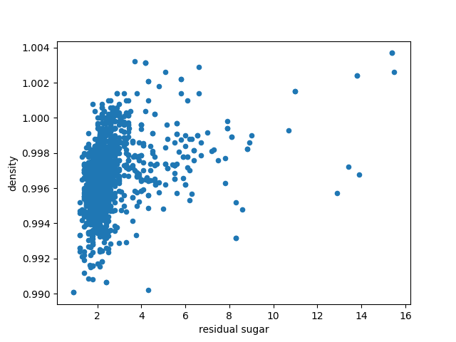
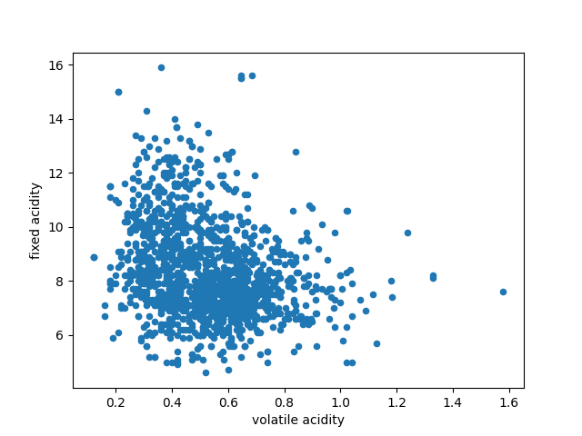

### INDEX NUMBER: 11015506
### NAME : Daniel Agyin Manford
### CLASS : CPEN
---
### PLOT OF VARIABLES
---

Here's a graph that shows the various variables against pH.

### Scatter Plot of Residual sugar and density
---

Here's a graph that shows the scatter plot of residual sugar and density.The values of density are  mostly concentrated within the range of values 2 to 4 of residual sugar.

### Scatter Plot of Volatile acidity and Fixed acidity
---

Here's a scatter plot of volatile acidity and fixed acidity.The values of fixed acidity is mostly concentrated between the range 0.2 and 1.0.

